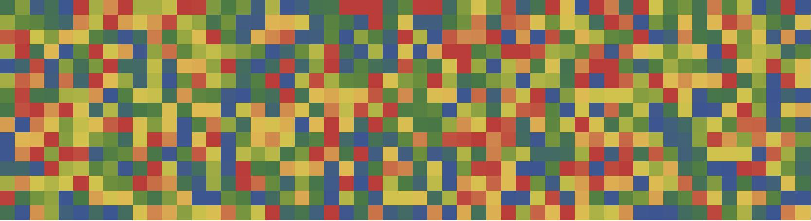

# 2017-2 Temas Selectos de Física Matemática y Teórica II (8307)
# Información cuántica y sistemas de espín

### Carlos Pineda, Instituto de Física, UNAM
### David Davalos, Instituto de Física, UNAM
El formato y métodos de este curso están inspirados en [este curso](https://github.com/lbenet/2016-2_TSFisicaComputacional). Sin embargo, el contenido del curso es bastante diferente. Ese curso evolucionó a una primera versión, que se puede encontrar [acá](https://github.com/carlospgmat03/2017-1_TS_Pineda). La liga al curso, en la facultad, se puede encontrar [acá](http://www.fciencias.unam.mx/docencia/horarios/detalles/280355).

La primera parte del curso trabajaremos de manera interactiva, cada quien con su computadora (o la computadora de la sala de computo), para ir aprendiendo a manejar las herramientas. A medida que el maestro o el ayudante van mostrando el progreso en el proyector, los estudiantes puede ir reproduciendo lo que ven en sus computadoras. Frecuentemente se les pedirá a los estudiantes que hagan ejercicios durante el transcurso de la clase. 

---

---

[//]: # (This may be the most platform independent comment)

**Lugar y horario**:
Salón 111 del Instituto de Física, horario por definir.
[//]: # (Laboratorio de Cómputo III, Depto Física (2o piso), Fac. Ciencias, UNAM,)
[//]: # (los lunes y martes 2:00-4:00 PM)

[//]: # (Nuestros datos de contacto están en la [página](http://www.fciencias.unam.mx/docencia/horarios/presentacion/274767) de presentación del curso.)

#### Contenido
1. Herramientas computacionales I: [git](https://www.atlassian.com/git/tutorials/) y [markdown](https://confluence.atlassian.com/display/STASH/Markdown+syntax+guide).
2. Herramientas computacionales II: [lenguaje Julia](http://julialang.org).
3. Sistemas cuánticos de uno y varios qubits.
4. Herramientas más avanzadas de mecánica cuántica.
5. Desarrollo del proyecto final semestral.

#### Calificaciones:
- **Tareas**: 30%.
- **Proyecto final**: 70%

Es requisito *indispensable* para entrar al examen final (presentación del
proyecto final) tener entregadas *y aceptadas* al menos 75% de las tareas. Las
tareas se enviarán como [pull
request](https://help.github.com/articles/using-pull-requests/) por GitHub. A
su debido tiempo, deben pasar los tests de CI Travis. El tiempo máximo de
entrega de cada tarea es de 2 semanas. Las tareas deben ponerse en el
directorio "tareas" y deben tener el formato 
~~~~
T(numero)(nombre).extension
~~~~
El número es el número de la tarea y el nombre su nombre, apodo, o alguna forma
de identificar el alumno. Por ejemplo, si voy a subir la segunda tarea, subiria
un archivo 
~~~~
T2carlos.ipynb
~~~~

El proyecto final consiste en estudiar un problema usando las 
herramientas desarrolladas en el curso y presentarlo en forma oral. Los
problemas serán propuestos a su debido tiempo. Pueden encontrar algunas
propuestas preliminares en el [temario](temario.md). La presentación consiste
de una charla de 10-15 minutos.

Las tareas son individuales; el proyecto final se puede hacer en equipo, pero
la presentación será individual. 

#### Materiales del curso

Aquí (en GitHub) encontrarán los distintos materiales que vamos a ir generando
durante el curso. Normalmente usaremos el [jupyter notebook](http://jupyter.org)
en combinación con [IJulia](https://github.com/JuliaLang/IJulia.jl) en clase.

#### Ligas de interés
- **Julia**
	- [http://julialang.org/](julialang.org)
	- [Tutorial de David Sanders (scipy2014)](https://github.com/dpsanders/scipy_2014_julia/blob/master/Introduction%20to%20Julia.ipynb)
	- [Hands_on_julia](https://github.com/dpsanders/hands_on_julia)
	- [JuliaBox](juliabox.org)
	- Libros para aprender Julia: 
		- [Julia High Performance de Avik Sengupta](https://www.packtpub.com/application-development/julia-high-performance)
- **Tutoriales de git**
	- [Become a Git guru](https://www.atlassian.com/git/tutorials/)
	- [Learn Git branching](http://pcottle.github.io/learnGitBranching)
	- [Hello World en GitHub](https://guides.github.com/activities/hello-world/)
	- [Sincronizar un fork](https://help.github.com/articles/syncing-a-fork/)
- **Guía de sintaxis en markdown**
	- [Markdown syntax guide](https://confluence.atlassian.com/display/STASH/Markdown+syntax+guide)
	- [Markdown quick reference](https://en.support.wordpress.com/markdown-quick-reference/)
- **Travis CI**
	- [Guía oficial](https://docs.travis-ci.com/)

#### Tarea para la siguiente clase

Para la siguiente clase deben tener instalado [git](https://git-scm.com/downloads)
en sus computadoras. Pueden encontrar ayuda en 
[https://help.github.com/articles/set-up-git/](https://help.github.com/articles/set-up-git/)
En Windows, se debería poder hacer click. Desde linux, depende 
de cada distribución. Es probable que ya lo tengan instalado. 

Aquellos que no quieran o no puedan traer su compu, deben avisarme y hacemos los ajustes necesarios. 

Deben poder ejecutar 
~~~~
git help
~~~~
y obtener algo como
~~~~
usage: git [--version] [--help] [-C <path>] [-c name=value]
           [--exec-path[=<path>]] [--html-path] [--man-path] [--info-path]
           [-p | --paginate | --no-pager] [--no-replace-objects] [--bare]
           [--git-dir=<path>] [--work-tree=<path>] [--namespace=<name>]
           <command> [<args>]

These are common Git commands used in various situations:

start a working area (see also: git help tutorial)
   clone      Clone a repository into a new directory
   init       Create an empty Git repository or reinitialize an existing one

work on the current change (see also: git help everyday)
   add        Add file contents to the index
   mv         Move or rename a file, a directory, or a symlink
   reset      Reset current HEAD to the specified state
   rm         Remove files from the working tree and from the index

examine the history and state (see also: git help revisions)
   bisect     Use binary search to find the commit that introduced a bug
   grep       Print lines matching a pattern
   log        Show commit logs
   show       Show various types of objects
   status     Show the working tree status

grow, mark and tweak your common history
   branch     List, create, or delete branches
   checkout   Switch branches or restore working tree files
   commit     Record changes to the repository
   diff       Show changes between commits, commit and working tree, etc
   merge      Join two or more development histories together
   rebase     Forward-port local commits to the updated upstream head
   tag        Create, list, delete or verify a tag object signed with GPG

collaborate (see also: git help workflows)
   fetch      Download objects and refs from another repository
   pull       Fetch from and integrate with another repository or a local branch
   push       Update remote refs along with associated objects

'git help -a' and 'git help -g' list available subcommands and some
concept guides. See 'git help <command>' or 'git help <concept>'
to read about a specific subcommand or concept.
~~~~

#### Objetivos clase 1:

- Explicar la forma en que se trabajará
- Explicar la forma en que se calificará
- Mostrar el temario
- Ponerse de acuerdo para el horario
- Dejar la tarea

